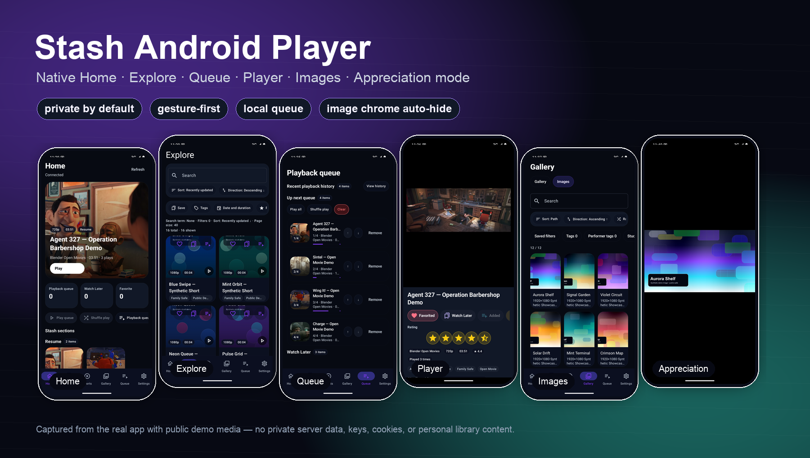
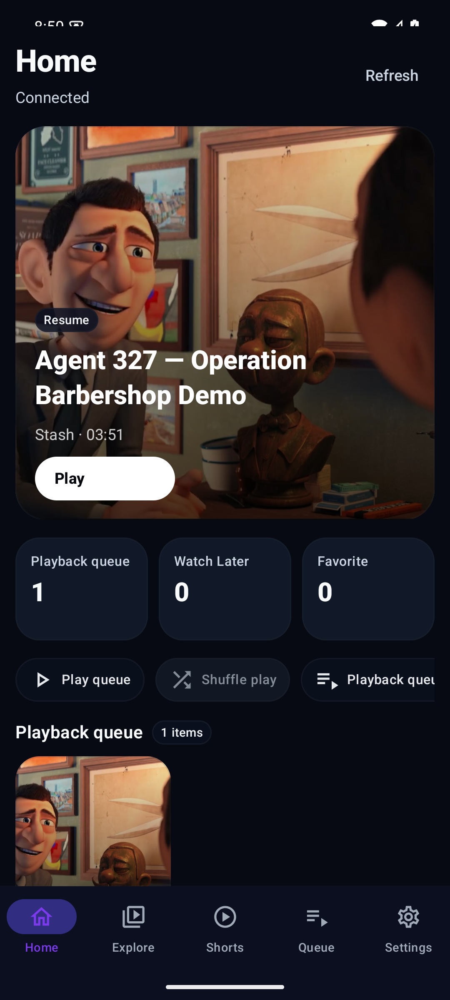
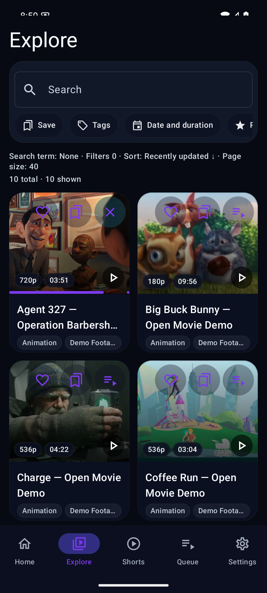
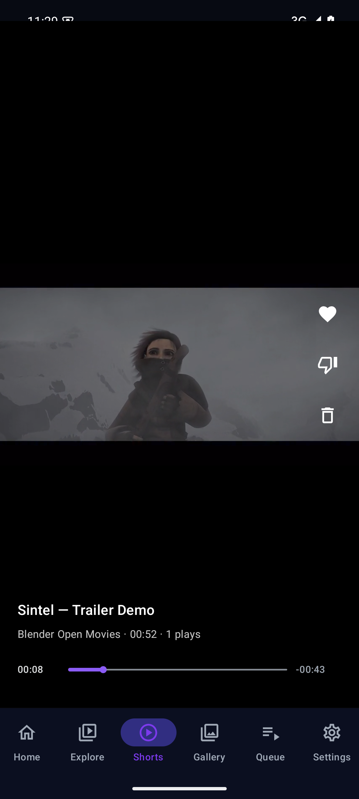
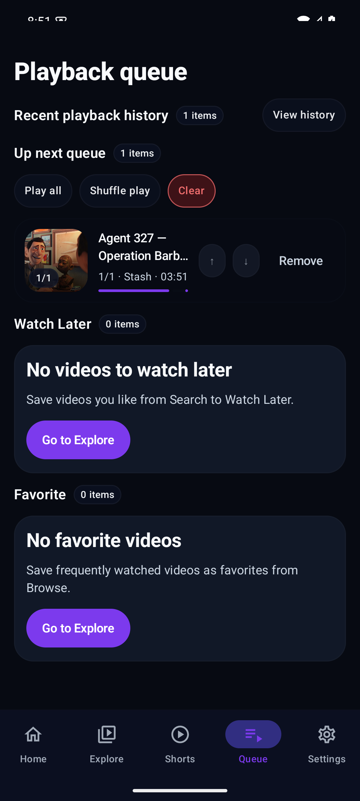
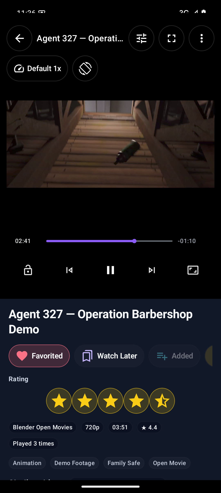
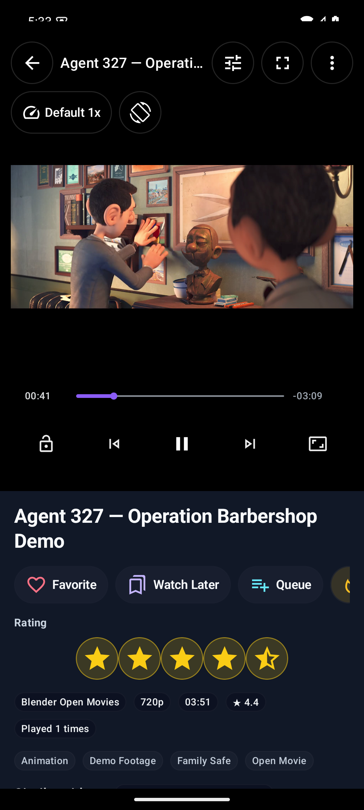
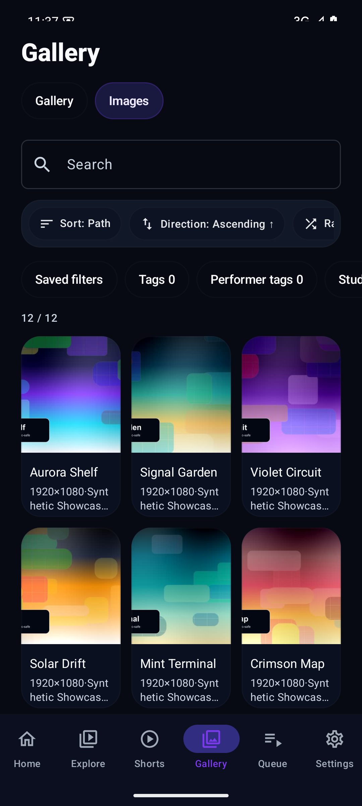
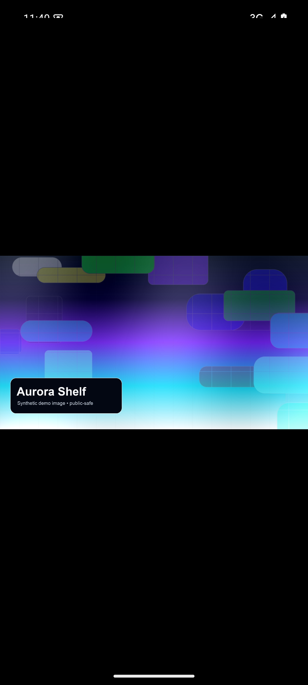

<div align="center">

# Stash Android Player

### Stash 라이브러리를 Android에서 진짜 앱처럼 봅니다.

이미 Stash 서버를 운영하는 사람을 위한 네이티브 Android 클라이언트입니다. 휴대폰에서 빠르게 찾고, 대기열을 만들고, 제스처로 감상하되 라이브러리는 계속 내 서버에 남겨둡니다.

<p>
  <a href="README.md"></a>
  <a href="README.zh-CN.md"></a>
  <a href="README.zh-TW.md"></a>
  <a href="https://github.com/gomeng-dev/stash-player-android/releases"></a>
  
  
</p>



</div>

---

## 왜 만들었나요?

Stash는 서버로서는 훌륭합니다. 그런데 휴대폰에서 데스크톱 웹 UI를 그대로 쓰면 종종 일이 됩니다.

**Stash Android Player**는 라이브러리를 내 Stash 서버에 그대로 두고, 매일 쓰는 탐색과 감상 경험만 Android 앱답게 바꿉니다. 빠른 이어보기, 하단 탭, 로컬 목록, 스와이프 친화적인 탐색, 휴대폰 제스처를 이해하는 플레이어가 핵심입니다.

별도 호스팅 계정이 필요하지 않습니다. 클라우드 동기화 서비스도 없습니다. 라이브러리 메타데이터를 이 프로젝트 서버로 업로드하지도 않습니다.

## 사용자가 체감하는 것

- **앱을 열면 바로 이어볼 수 있습니다.** 최근 보던 영상, 재생 대기열, 나중에 보기, 탐색으로 빠르게 들어갑니다.
- **탐색이 앱답습니다.** 검색, 필터, 정렬, 셔플, 레이아웃 변경, 저장 필터, 다중 선택을 한 화면에서 처리합니다.
- **휴대폰만의 로컬 목록을 가질 수 있습니다.** 재생 대기열, 나중에 보기, 즐겨찾기, 최근 재생, 숏츠 피드백은 기기에 저장됩니다. 서버 라이브러리를 매번 건드리지 않아도 됩니다.
- **영상 주변 정보가 한 화면에 모입니다.** Watch page에서 메타데이터, 평점, 태그, 액션, 비슷한 영상, 플레이어를 함께 봅니다.
- **플레이어가 손에 붙습니다.** 더블탭 탐색, 가로 스크럽, 좌우 밝기/볼륨 제스처, 길게 눌러 임시 배속, 잠금, 스트림 선택, 자막, PiP, 전체화면, 재생목록 조작을 지원합니다.
- **갤러리와 이미지도 봅니다.** 서버 기반 갤러리와 이미지 폴더를 탐색하고, 사진 뷰어 감상 모드에서 상단바와 하단 조작부를 숨겨 볼 수 있습니다.
- **추천 플러그인이 있으면 더 좋아집니다.** Stash Hybrid Recommendations Engine이 있으면 우선 사용하고, 없으면 Stash 기본 추천 데이터로 fallback합니다.

## 스크린샷

실제 Android 앱에서 공개 데모 미디어로 캡처했습니다. 개인 미디어, 서버 주소, API key, 인증 정보, 쿠키, 개인 라이브러리 데이터는 보이지 않습니다.

<p align="center">
  
  
  
</p>
<p align="center">
  
  
  
</p>
<p align="center">
  
  
</p>

## 보통 이렇게 씁니다

### 1. 홈에서 바로 이어보기

홈은 앱을 열자마자 감상을 시작하는 곳입니다. 최근 영상 이어보기, 대기열 재생, 나중에 보기 확인, 탐색 진입을 빠르게 처리합니다.

### 2. 필터 때문에 헤매지 않고 찾기

탐색은 browse와 search를 합친 화면입니다. 태그, 날짜, 길이, 평점, 시청 상태, 로컬 즐겨찾기, 해상도/파일 타입 등을 기준으로 걸러볼 수 있습니다. 뭘 볼지 고르기 귀찮을 때는 무작위 정렬과 다시 섞기를 쓰면 됩니다.

### 3. 이번에 볼 목록 만들기

Up Next에 넣고, 나중에 볼 항목을 저장하고, 앱 안에서만 쓰는 즐겨찾기를 남깁니다. 서버 라이브러리 전체를 바꾸지 않고도 휴대폰에서의 감상 흐름을 정리할 수 있습니다.

### 4. 휴대폰 제스처로 보기

플레이어는 터치 조작을 중심으로 설계했습니다.

- 탭해서 조작 UI 보이기/숨기기
- 더블탭으로 앞뒤 이동
- 가로 드래그로 스크럽
- 화면 좌우 스와이프로 밝기/볼륨 조절
- 길게 눌러 임시 배속 재생
- 실수로 건드리지 않도록 잠금
- 오버레이에서 스트림, 자막, 화면 비율, 방향, 재생목록 항목 전환

### 5. 추천이 있으면 이어서 보기

Stash 서버에 Hybrid Recommendations 플러그인이 설치되어 있으면 비슷한 영상을 그 엔진에서 가져옵니다. 플러그인이 없거나 꺼져 있어도 Stash 기본 추천 데이터로 대체합니다.

### 6. UI 없이 이미지 감상하기

Images 탭에서는 검색, 정렬, 필터와 전체화면 보기를 지원합니다. 사진 뷰어의 감상 모드를 켜면 상단바와 하단 도구가 숨겨져 이미지 자체에 집중할 수 있습니다.

## 설치하기

1. Android 휴대폰에서 [최신 공개 릴리즈](https://github.com/gomeng-dev/stash-player-android/releases)를 엽니다.
2. APK 파일을 다운로드합니다.
3. APK를 열고, Android가 요청하면 브라우저나 파일 관리자에 APK 설치 권한을 허용합니다.
4. **Stash Player**를 실행하고 Stash 서버를 연결합니다.

현재 공개 릴리스: **v1.10.6**

## 필요 조건

- Android 10 이상
- 휴대폰에서 접근 가능한 Stash 서버. LAN, VPN, Tailscale, 직접 구성한 HTTPS reverse proxy 모두 가능합니다.
- 다음 중 하나의 인증 방식
  - 인증을 끈 신뢰 가능한 로컬 서버
  - Stash API key
  - Stash 아이디/비밀번호 로그인
- 선택 사항: 더 풍부한 비슷한 영상 추천을 위한 [Stash Hybrid Recommendations](https://github.com/gomeng-dev/stash-recommendation-server)

## 처음 연결하기

첫 실행 화면에서 Stash 서버 주소를 입력하고, 서버 설정에 맞는 인증 방식을 선택합니다.

자주 쓰는 예시:

- `http://192.168.0.10:9999`
- `http://stash.local:9999`
- 직접 구성한 HTTPS reverse proxy 주소

**연결 테스트**를 눌러 성공하면 저장하세요. 이후 홈 화면이 열립니다.

## 개인정보와 보안

이 앱은 사용자의 Stash 서버에 직접 연결하는 클라이언트입니다.

- 서버 설정, API key, 세션 쿠키, 로컬 목록, 재생 기록, 숏츠 피드백은 기기에 저장됩니다.
- ID/비밀번호 로그인은 세션 갱신에 필요한 정보를 저장합니다. 기기 백업이나 디버그 로그를 공개하지 마세요.
- 최근 앱 화면 숨기기 옵션으로 Android 최근 앱 목록의 미리보기를 숨길 수 있습니다.
- 디버그 로그는 민감한 인증 정보를 숨기도록 처리합니다.
- 직접 스크린샷을 공유할 때는 실제 서버 주소, 파일명, 인증 정보, 개인 미디어가 보이지 않는지 먼저 확인하세요.

## 문제 해결

| 문제 | 확인할 것 |
| --- | --- |
| 연결 실패 | 휴대폰이 같은 네트워크, VPN, 또는 reverse proxy를 통해 Stash 주소에 접근 가능한지 확인하세요. |
| 썸네일이 보이지 않음 | 서버 연결 테스트를 다시 실행하고, 현재 인증 방식이 Stash에서 유효한지 확인하세요. |
| 앱 재시작 후 로그인이 풀림 | 설정에서 아이디/비밀번호를 다시 입력해 세션 갱신 정보를 업데이트하세요. |
| 숏츠가 비어 있음 | 설정의 숏츠 최대 길이보다 짧은 영상이 라이브러리에 있는지 확인하세요. |
| 추천이 비어 있음 | Hybrid Recommendations 플러그인이 켜져 있는지 확인하거나 Stash 기본 추천 fallback을 사용하세요. |
| APK 설치가 막힘 | APK를 연 브라우저/파일 관리자/설치 앱에 APK 설치 권한을 허용하세요. |

## 개발자용 정보

이 README는 설치하고 사용하는 사람을 위해 썼습니다. 빌드 방법, 프로젝트 구조, 서명, 검증 명령은 [DEVELOPMENT.md](DEVELOPMENT.md)에 있습니다.

로컬 debug APK 빌드:

```bash
./gradlew :app:assembleDebug
```

## 라이선스

MIT. 자세한 내용은 [LICENSE](LICENSE)를 참고하세요.
