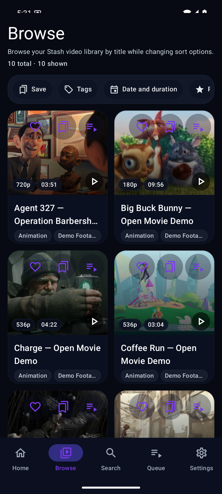
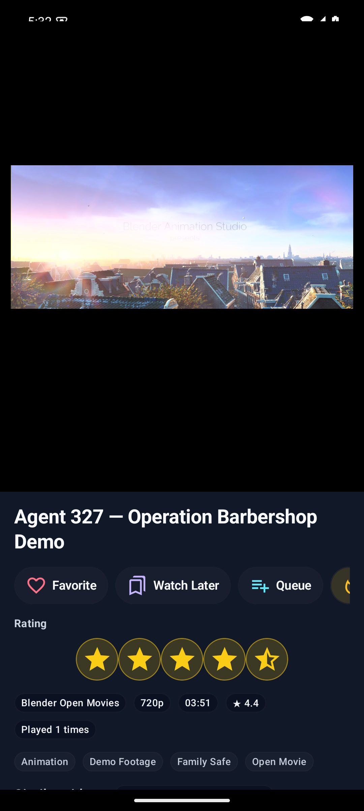
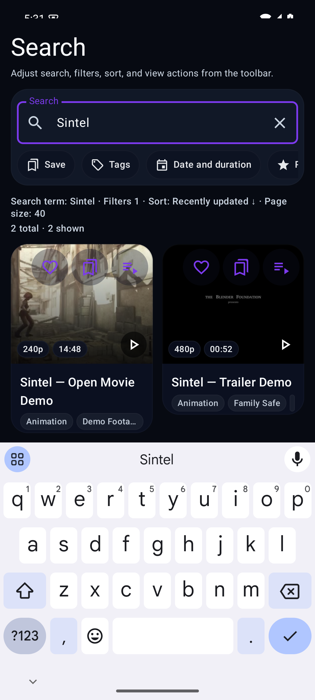

<div align="center">

# Stash Android Player

### A polished Android companion for your self-hosted [Stash](https://github.com/stashapp/stash) library.

Browse, search, queue, and watch your Stash collection from a phone or tablet with a native Jetpack Compose interface built around fast thumbnails, gesture-first playback, and local privacy.

<p>
  <a href="https://github.com/gomeng-dev/stash-player-android/releases"></a>
  
  
  <a href="LICENSE"></a>
</p>

</div>

<p align="center">
  
  
  
  
</p>

---

## Why this app?

Stash is excellent on the desktop, but a phone needs a different rhythm: quick resume, thumb-friendly browsing, predictable playback controls, and no cloud service sitting between you and your own server.

Stash Android Player is designed as a **native mobile front-end** for Stash:

- Directly connects to your own Stash server.
- Keeps sensitive server details and local lists on the device.
- Uses a dark, media-first UI optimized for one-handed browsing.
- Plays scenes with Android Media3/ExoPlayer.
- Integrates with Stash recommendations when the server/plugin supports them.

No hosted backend. No third-party sync. No library scraping outside your Stash instance.

## Highlights

| Area | What you get |
| --- | --- |
| **Home** | Continue watching, local favorites, Watch Later, queue shortcuts, and library highlights. |
| **Browse** | Mobile-first scene grid with filters for tags, date, duration, rating, watched state, resolution, file type, shuffle/random, and saved filters. |
| **Search** | Fast scene search with safe empty/loading/error states and thumbnail-focused results. |
| **Player** | Media3 playback, screenshot-style chrome, fullscreen controls, double-tap seek, horizontal scrub, side brightness/volume gestures, long-press speed hold, lock mode, and player-level orientation control. |
| **Local library tools** | Room-backed local favorites, Watch Later, playback queue, and playback history. |
| **Recommendations** | Shows Stash Hybrid Recommendations when available, with Stash GraphQL recommendations as a fallback. |
| **Privacy** | Credentials and local state stay on the device. The app does not operate a hosted service for your library. |

## Screenshots

<table>
  <tr>
    <td align="center" width="33%">
      <br>
      <strong>Home</strong><br>
      Resume, queue, local lists, and library entry points.
    </td>
    <td align="center" width="33%">
      <br>
      <strong>Browse</strong><br>
      A thumbnail-first grid for the full scene library.
    </td>
    <td align="center" width="33%">
      <br>
      <strong>Search</strong><br>
      Find scenes quickly with focused mobile results.
    </td>
  </tr>
  <tr>
    <td align="center" width="33%">
      <br>
      <strong>Queue</strong><br>
      Local queue, Watch Later, and playback history surfaces.
    </td>
    <td align="center" width="33%">
      <br>
      <strong>Scene details</strong><br>
      Metadata, tags, similar videos, and recommendations.
    </td>
    <td align="center" width="33%">
      <br>
      <strong>Player</strong><br>
      Screenshot-style playback chrome with gesture-first controls.
    </td>
  </tr>
</table>

## Install

1. Download the latest APK from [GitHub Releases](https://github.com/gomeng-dev/stash-player-android/releases).
2. Open the APK on your Android device.
3. If Android asks, allow installs from the browser or file manager you used to download it.
4. Launch **Stash Android Player** and connect it to your Stash server.

> Current app version: **v1.4.1**.

## Requirements

- Android 10 or newer.
- A reachable [Stash](https://github.com/stashapp/stash) server.
- Stash API access, or a Stash login session, when your server requires authentication.
- Optional: [Stash Hybrid Recommendations](https://github.com/gomeng-dev/stash-recommendation-server) for richer recommendation cards.

## Connect your server

On first launch, enter your Stash server URL and choose the authentication method your server uses.

Supported connection modes include:

- API key authentication.
- Login/session-based authentication.
- Local or trusted direct server connections for private networks.

If you omit a URL scheme, the app uses plain HTTP by default, matching common local Stash setups. Treat Stash URLs, API keys, session cookies, and debug logs as private.

## Player gestures

The player is built around common mobile video gestures:

- Tap to show or hide controls.
- Double-tap left or right to seek.
- Drag horizontally to scrub.
- Swipe on the sides for brightness and volume.
- Long-press for temporary speed hold.
- Lock controls during playback.
- Toggle orientation from the player chrome.

## Privacy model

Stash Android Player is a direct client for your own Stash server.

- Your server URL, API key, and session data stay on your device.
- Local favorites, Watch Later, queue, and history are stored locally on the device.
- The recent-apps preview privacy switch can hide sensitive playback surfaces from Android recents.
- The app does not send your library metadata to a hosted service controlled by this project.
- Recommendation data comes from your Stash server/plugin when configured.

Avoid publishing screenshots or logs that expose your real server address, credentials, filenames, or private media.

## Development

Build instructions, stack details, and signing notes are in [DEVELOPMENT.md](DEVELOPMENT.md).

Quick local build:

```bash
./gradlew :app:assembleDebug
```

Useful project facts:

- Kotlin + Jetpack Compose.
- Android Media3/ExoPlayer.
- Room for local lists and playback state.
- Retrofit/OkHttp/Moshi for Stash GraphQL/API transport.
- Minimum SDK 29, target SDK 35.

## License

MIT. See [LICENSE](LICENSE).
